# Hosting Static Website On S3 Using Terraform

## Project Overview:

This project demonstrates how to deploy a secure static website hosting architecture on AWS using Terraform.
The website's static content is stored in an Amazon S3 bucket, while Amazon CloudFront provides the public-facing content delivery layer.
The S3 bucket is configured as a private origin and is not directly exposed to the public internet.
CloudFront uses Origin Access Control (OAC) to securely retrieve objects from the S3 bucket.
The entire infrastructure is managed using Terraform, following an Infrastructure as Code approach.

## Architecture:
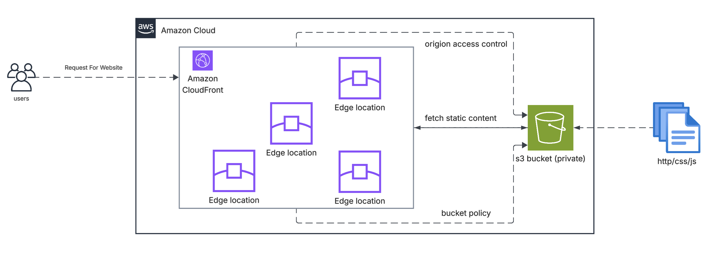

## Project Objectives:
The main objectives of this project are:

1. Host static website content using Amazon S3.
2. Keep the S3 bucket private.
3. Use CloudFront as the public content delivery layer.
4. Use Origin Access Control to allow CloudFront to access S3.
5. Manage the infrastructure using Terraform.
6. Gain practical experience with AWS IAM and resource policies.
7. Build a portfolio project demonstrating secure AWS architecture.

## Security Architecture"

Security is one of the main design considerations in this project.
The S3 bucket is configured to block public access.
Users do not access the S3 bucket directly.
Instead:

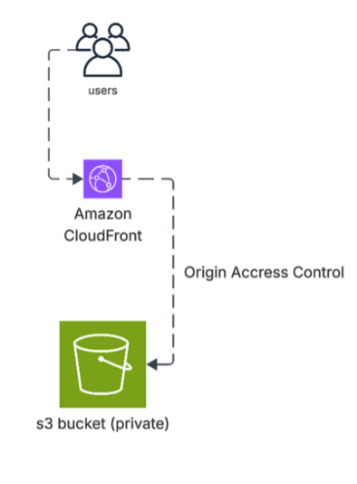

This provides a controlled access path between CloudFront and S3.

## CloudFront Origin Access Control:

CloudFront Origin Access Control (OAC) is used to allow CloudFront to retrieve objects from the private S3 bucket.
The S3 bucket policy grants the CloudFront distribution permission to access the required objects.
The intended access model is:

User -> CloudFront (Authorized Request) -> S3

rather than:

User -> (Public Access) -> S3

This helps prevent direct public access to the storage bucket.

## Why Amazon CloudFront?

CloudFront provides a CDN layer between the users and the S3 origin.
Static content can be cached at AWS edge locations.
Benefits include:

* Global content delivery
* Reduced latency
* Content caching
* Reduced origin requests
* Scalable static content delivery

The website can currently be accessed through the CloudFront distribution domain.

## Amazon S3:

Amazon S3 is used as the origin storage layer.
The bucket stores static website assets such as:

index.html
style.css
assert/

The bucket is intentionally configured as a private bucket.
Public access is blocked, and CloudFront provides the controlled access path.

## Infrastructure as Code with Terraform:

Terraform is used to provision the AWS infrastructure.
Instead of manually creating resources through the AWS Management Console, the resources are defined in Terraform configuration files.
This provides:

* Repeatable infrastructure
* Version control
* Infrastructure automation
* Consistent configuration
* Easier troubleshooting
* Reproducible deployments

## Project Structure:

terraform-static-website/
|
|--README.md
|
|--main.tf
|--providers.tf
|--variables.tf
|--outputs.tf
|
|--s3.tf
|
|--www/
  |--index.html
  |--style.css
  |--assert/
  
Your actual file structure may differ depending on how the Terraform project is organised.

## Technologies Used:

Terraform > Infrastructure as Code
AWS S3 > Static website content storage
AWS CloudFront > CDN and content delivery
CloudFront OAC > Secure S3 origin access
IAM	> Access control and permissions

## Improvements:
Improvements include:

* Register a custom domain
* Add Amazon Route 53
* Add AWS Certificate Manager

## Improved Architecture:

## Project Outcome:
The completed implementation demonstrates how to build a secure static website hosting architecture using AWS and Terraform without exposing the S3 bucket directly to the public internet.

The architecture separates:

Storage → Delivery → Access

Private S3
    ↓
CloudFront
    ↓
Users

Terraform provides the automation and Infrastructure as Code layer.

# Implementation of the Current Project:

## Prerequisites
Before deploying this project, install:

Terraform
AWS CLI
Git
An AWS account

### Verify Terraform:
terraform version

### Verify AWS CLI:
aws --version

### Verify AWS authentication:
aws sts get-caller-identity

## AWS Configuration:

Configure your AWS credentials using the AWS CLI:
aws configure

### Then verify your identity:

aws sts get-caller-identity
For production environments, avoid committing AWS access keys to GitHub.

## Deployment:

### 1. Clone the repository
git clone <GITHUB_REPOSITORY_URL>

### 2. Navigate into the project:
cd Hosting_Static_Website_On_S3_Using_Terraform

### 3. Static Website content
Add your static website files and folders in "www" folder
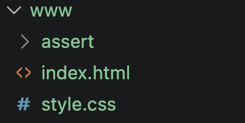

### 4. Initialise Terraform
terraform init
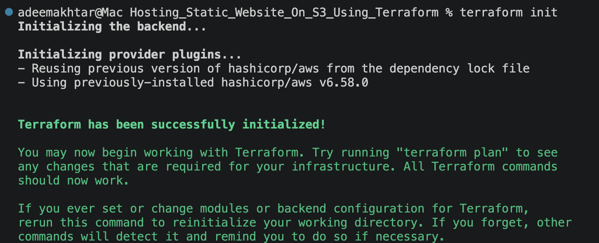

### 5. Format the Terraform configuration
terraform fmt

### 6. Validate the configuration
terraform validate
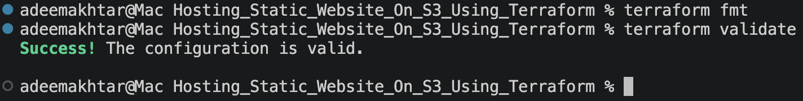

### 7. Review the Terraform plan
terraform plan
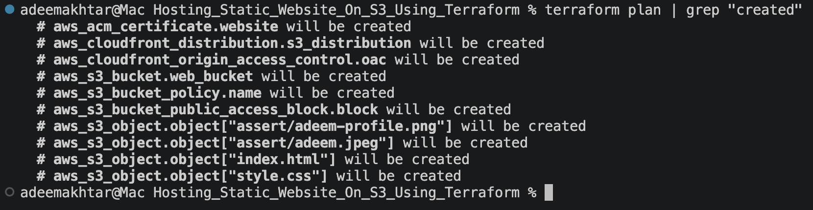

### 8. Deploy the infrastructure
terraform apply --auto-approve
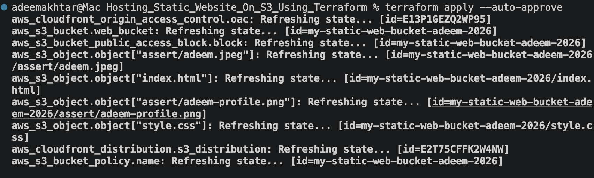

### 9. Review the resources on AWS and Access the Website
After the CloudFront distribution has been deployed, retrieve the CloudFront domain name from Terraform:

terraform output
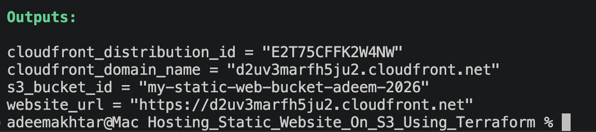

Check S3 and CloudFront deployment on AWS:
S3:
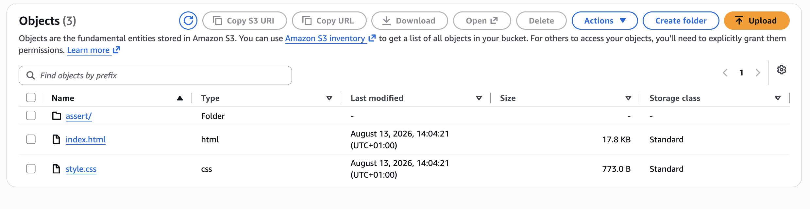

CloudFront:
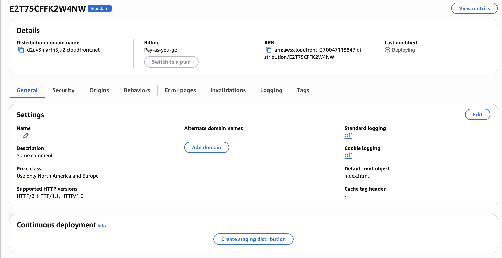

The website can then be accessed using the CloudFront domain:

https://xxxxxxxx.cloudfront.net

CloudFront distributions may take some time to become fully deployed.

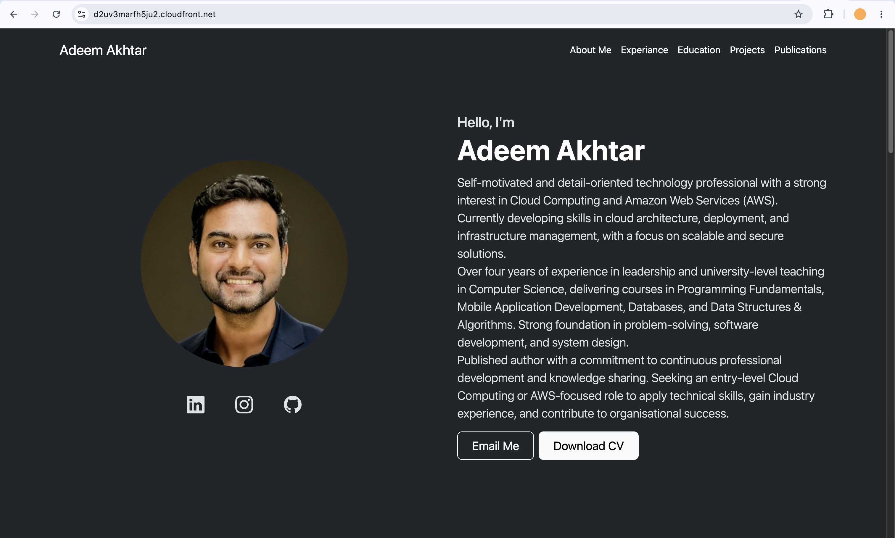

### 10. Destroy the Infrastructure
When the project is no longer required:
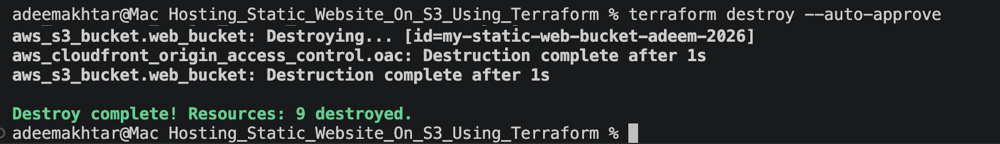

terraform destroy --auto-approve

Review the resources Terraform plans to remove before confirming.

Important: Be careful when destroying S3 resources containing important data.